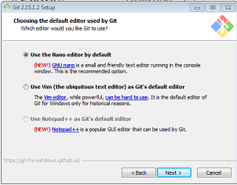

# Install

To get this to work, you need the following software installed on your laptop:

- `git-bash` to get use to the command line we will be using on our linux robots
- `python` which will be our primary programming language
- OpenCV 3.4.x for computer vision
- Jupyter notebooks, most of the class material is written in this and you will need it to turn some homeworks and labs

## Git-Bash



1. Grab the git-bash package from [git-scm.com](https://git-scm.com/download/win)
    1. Take the default options, but there is a new one, see below:
    1. Something like the second window now asks if you want to install the nano text editor. I like
    nano, it is a very simple editor. Otherwise your default is vim, which is insanely complex
    and I personnally dislike.
1. Now to open a bash window, you can double click on the git-bash icon on your desktop or from the start menu: All Programs -> Git -> Git Bash

Also to make your life a little easier, use this `.bash_profile` (*note:* there
is a `.` on the front of the file name to indicate it is hidden). Just place this
in a simple text file and leave it in your home directory `C:/Users/<your name>`, my home folder, 
for example, is: `C:/Users/Kevin.Walchko`:

```bash
# start .bash_profile -------------------------
export PATH=/c/Python27:/c/Python27/Scripts:$PATH
alias python='winpty /c/Python27/python.exe'
alias pip='python -m pip'
alias ll='ls -lh'
alias ls='ls -Fh --color=auto --show-control-chars'

USR="\[\033[01;32m\]"
HOST="\[\033[01;35m\]"
DIR="\[\033[01;34m\]"
END="\[\033[0m\]"

export PS1="$USR\u@$HOST\h $DIR\W$END \$ "

# for some stupid reason, bash starts at root level
cd ~

# end .bash_profile ---------------------------
```

If there is already a `.bash_profile` there, then overwrite it with this one.

## Python

### Microsoft Compiler for Python 2.7

In order to build some of the python packages we need, you have to have a compiler
installed. For linux/unix, this isn't an issue. For Windoze, we need to get and
install one.

1. Download the [https://www.microsoft.com/en-us/download/details.aspx?id=44266](https://www.microsoft.com/en-us/download/details.aspx?id=44266)
1. Once you have it, double click and install it

### Install Python

**YOU MUST USE PYTHON 2.7**

1. Grab the python package from [https://www.python.org/downloads/windows/](https://www.python.org/downloads/windows/)
1. You should have something like `python-2.7.14.amd64.msi` which is the x86-64 MSI
installer, run that and install the software to your C: drive
1. Open a bash window
1. Update your software with: `pip install -U pip setuptools wheel`
1. Then install other python libraries: `pip install -U ar_markers future pysparklines pyserial the-collector numpy PyYAML nose simplejson fake-rpi build-utils`

## OpenCV 3.4.0 (or newest)

1. Download OpenCV 3.4.x from [https://github.com/opencv/opencv/releases](https://github.com/opencv/opencv/releases). Look for a file name like `opencv-3.4.0-vc14_vc15.exe`. Obviously if the current version is `3.4.2`, the the filename will have that version number in it instead of `3.4.0` Your browser should put it in your `Downloads` folder. If it goes else where, then adjust the instructions below.
1. Go to the download location and double click on the `exe`, this will decompress it and create a `opencv` folder
1. Grab the opencv library (`cv2.pyd`) and put it into your python library
    1. from: `C:\Users\<your username>\Downloads\opencv\build\python\2.7\x64\cv2.pyd`
    1. to: `C:\Python27\Lib\site-packages`
1. Now test:
    1. open a bash window
    1. run: `python`
    1. type: `import cv2`
    1. if there are no errors ... you are good!
    1. type: `cv2.__version__` and the current version should come up ... something like 3.4.0 or whatever version you downloaded.

If you ever need to update your system to a new version, like `3.4.4`, you can repeat this process. You *might* need to update the python library `numpy`, but that should be easily fixed with" `pip install -U numpy`. OpenCV and `numpy` are tighly coupled.

## Jupyter Notebooks

You have to have Python and GitBash installed already before you do this.

1. Open a bash window
1. Run: `pip install -U pip setuptools wheel`
1. Run: `pip install -U numpy jupyter opencvutils matplotlib jupyter_tools sympy`
1. Once that finishes installing, run: `jupyter notebook`
1. A webpage should open up. From there you can create or
   navigate to where your jupyter notebooks are stored and open them.

## VS Studio


I am not a microsoft fan, but 10CS makes using my editor of choice Atom difficult
to use here at USAFA. I have played around with Visual Studio Code which is **very**
similar to Atom, so I will make a suggestion if you need a decent python editor.

Download: https://code.visualstudio.com/?wt.mc_id=DX_841432

Just remember I haven't really done much with it yet.